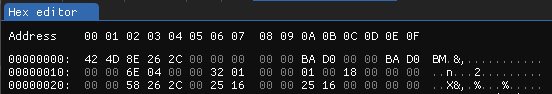
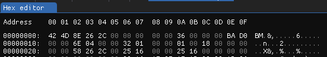
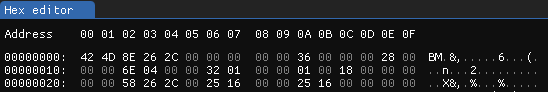
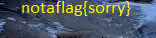

# tunn3l v1s10n

We found this file (`tunn3l_v1s10n`). Recover the flag.

## Solution

First step is to investigate what type of file this is. Running `exiftool tunn3l_v1s10n` outputs the following:

```
$  exiftool tunn3l_v1s10n
ExifTool Version Number         : 11.88
File Name                       : tunn3l_v1s10n
Directory                       : .
File Size                       : 2.8 MB
File Modification Date/Time     : 2023:04:08 20:34:42+02:00
File Access Date/Time           : 2023:04:08 20:38:23+02:00
File Inode Change Date/Time     : 2023:04:08 20:36:02+02:00
File Permissions                : rwxrwxrwx
File Type                       : BMP
File Type Extension             : bmp
MIME Type                       : image/bmp
BMP Version                     : Unknown (53434)
Image Width                     : 1134
Image Height                    : 306
Planes                          : 1
Bit Depth                       : 24
Compression                     : None
Image Length                    : 2893400
Pixels Per Meter X              : 5669
Pixels Per Meter Y              : 5669
Num Colors                      : Use BitDepth
Num Important Colors            : All
Red Mask                        : 0x27171a23
Green Mask                      : 0x20291b1e
Blue Mask                       : 0x1e212a1d
Alpha Mask                      : 0x311a1d26
Color Space                     : Unknown (,5%()
Rendering Intent                : Unknown (826103054)
Image Size                      : 1134x306
Megapixels                      : 0.347
```

Looks like we have a `.bmp`-file! Renaming the file to `tunn3l_v1s10n.bmp` still cannot open the file - it seems like it is corrupted. It might be the file header? Let's inspect it!

Opened up the file using a hex editor, and studied the bitmap file header on the [Wiki page](https://en.wikipedia.org/wiki/BMP_file_format)



As seen, the header starts with `0x42 0x4D` like it is supposed to do. Looking at the [BMP file format photo](https://en.wikipedia.org/wiki/BMP_file_format#/media/File:BMPfileFormat.svg) on Wikipedia it seems like `0xBA 0xD0 0x00 0x00` corresponds to the "File Offset to PixelArray". If this contains the wrong value, the file would be corrupted, I think? 

The bitmap file header is 14 bytes & the DIB header is 40 bytes, which together adds up to 54 bytes (`0x36`). Therefore, the "File Offset to PixelArray" mentioned above should be equal to `0x36`. Let's change that. 



However, not able to open the file just yet. The start of the DIB header corresponds to "DIB header size", which is currently set to `0xBA 0xD0 0x00 0x00` which obviously is wrong. As mentioned above, the DIB header is 40 bytes (`0x28`). Let's change that :)



Progress! We can now open the file. It does however seem like we aren't done just yet. The resulting image contains `notaflag{sorry}`. 



After playing around with the image height/width, I realized that there is actually more data to the image than what it originally displays. Adjusting the height eventually displays a flag! 🚩

### Comment

I realized that another way to realize that the image is smaller than intended, is to look at the output of the `exiftool` displayed above. We see that the image is 1134x306 pixels, along with a bit depth of 3 bytes. This will result in `1134 x 306 x 3` bytes which is approximately 1MB. However, since the file size is 2.8MB, there must be data in the image that isn't displayed. Very clever!!

### Thoughts

Never done one of these before, so it was actually interesting to play around w this. Might also explain the lengthy explanation above ヽ(o＾▽＾o)ノ


